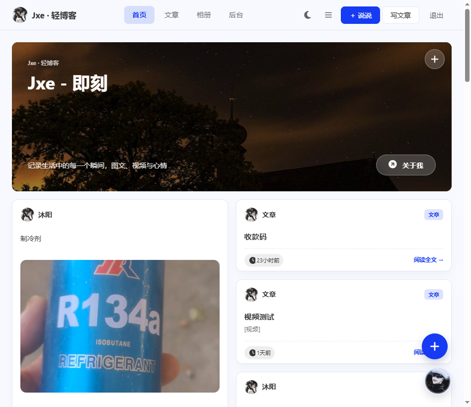
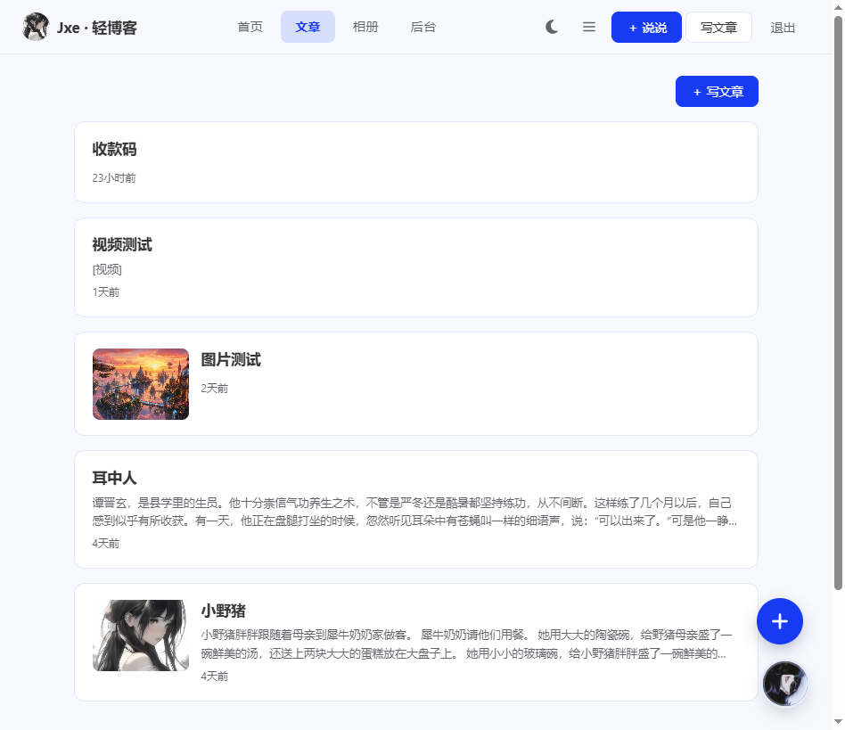
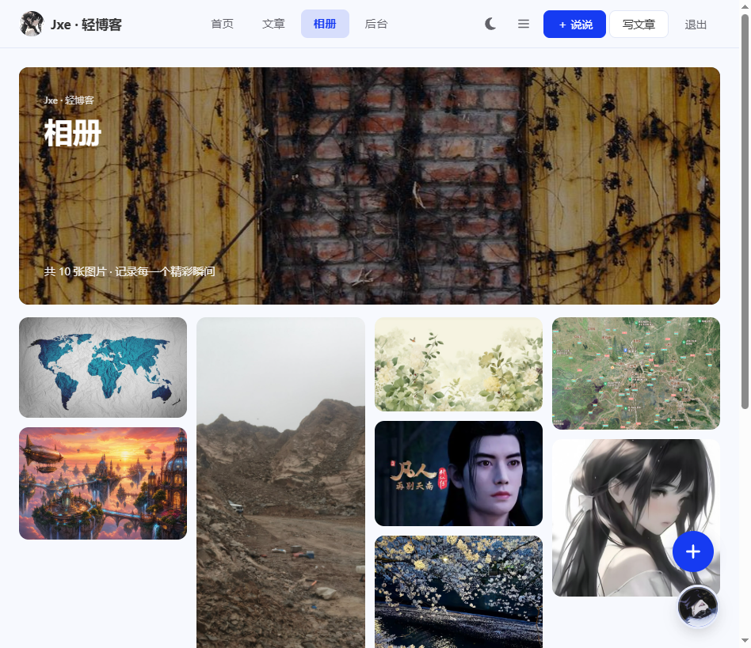

<p align="center"></p>

<h1 align="center">Jxe · 轻博客</h1>

<p align="center">基于 Hono + Cloudflare Workers 的朋友圈式轻博客，单 Worker、零服务器、边缘运行</p>

<p align="center">
  <a href="https://deploy.workers.cloudflare.com/?url=https://github.com/mliae/moments">
    
  </a>
  <a href="https://e.jxe.me/">
    
  </a>
  
  
</p>

---

## 预览

<p align="center">
  
  <br><em>首页 · 说说与文章混合时间线</em>
</p>

<p align="center">
  
  <br><em>文章列表 · Markdown 文章</em>
</p>

<p align="center">
  
  <br><em>相册 · 瀑布流图集</em>
</p>

线上示例：<https://e.jxe.me/>

---

## 功能特性

### 内容创作

- **说说**：图文动态流，多图上传 + 地理定位（两阶段 GPS + IP 兜底）+ MP4 / M3U8 视频
- **文章**：Markdown 编辑，草稿 / 发布 / 编辑 / 删除，自动 slug（标题拼音）、自动摘要、预览，HTML 消毒防 XSS
- **相册**：图集瀑布流，灯箱浏览
- **音乐**：内置播放器，Markdown 通过 `[music=ID]` 块插入

### 互动与社交

- **评论**：楼中楼回复，表情面板（8 分类）、图片上传 + 网络图片 URL、随机评论一键填充、QQ 号自动解析昵称头像（多源容错 + 后台可配）
- **点赞**：访客匿名 uuid 去重，无需登录
- **@AI 智能回复**：评论 `@小J` 触发 Workers AI 异步生成楼中楼回复（默认关闭，后台「AI 助手」开启）

### 管理后台

- 8 个单职责 Tab：说说 / 文章 / 相册 / 评论 / 外观 / 媒体 / AI 助手 / 安全
- 密码登录 + 暴力破解防护（5 次失败锁 15 分钟）+ 自定义入口路径（`/admin` 或 `/sys-xxx`，未知路径直接 404 伪装）
- 动态域名配置（`site_domain` / `r2_domain`），媒体路径自动适配 Worker 代理或 R2 直连

### 媒体与视频

- 图片上传自动生成 1200px 缩略图（`_w1200.jpg`，82% 质量），GIF 跳过，点击加载原图，404 自动回退
- MP4 本地上传（≤100MB，Range 206 拖动 seek），M3U8 外链（hls.js 优化配置：`startFragPrefetch`、`maxBufferLength: 60`）
- HEVC 编码 MP4 浏览器端 ffmpeg.wasm 转码为 H.264 后上传
- 竖屏视频限高 70vh 防止撑变形

### SEO

- `sitemap.xml`、`rss.xml`、`robots.txt` 自动生成
- 文章路由使用标题 slug（如 `/post/耳中人`），利于 SEO 与可读性

---

## 技术栈

| 层 | 技术 |
| --- | --- |
| 后端 | Hono 4（单 Worker） |
| 前端 | 原生 HTML + JavaScript + CSS（`app.js` / `style.css` / `index.html`） |
| 编辑器 / 渲染 | marked（Markdown）、contenteditable |
| 视频 | hls.js（M3U8）、@ffmpeg/ffmpeg + @ffmpeg/core（HEVC 转码） |
| 平台 | Cloudflare Workers、D1、R2、Workers AI、Assets |
| 工程 | Wrangler 4、TypeScript 5 |

---

## 架构

```
浏览器请求
   │
   ▼
Cloudflare Worker（moments，e.jxe.me）
   ├─ /api/*                                ─► Hono 路由（src/routes/*）
   ├─ /media/*                              ─► R2 代理（r2_domain 未配置时）
   ├─ /imgproxy                             ─► 图片代理
   ├─ /, /posts, /post/*, /photos, /admin   ─► SSR HTML（src/index.ts）
   └─ 静态文件                              ─► Assets（public/，含 vendor）
```

- 前后端**同 Worker**，无 Service Binding 网络跳转
- 数据绑定：D1 `moments-db`、R2 `moments-storage`、Workers AI
- 静态资源由 Workers Assets 直接服务，动态路径（`run_worker_first`）先进 Worker

---

## 项目结构

```
moments/
├── src/
│   ├── routes/            # Hono 路由
│   │   ├── admin.ts       # 登录/上传/设置/首次设密码
│   │   ├── feed.ts        # 说说流
│   │   ├── misc.ts        # QQ 昵称 / 评论图片上传 / 地理逆解析
│   │   ├── moments.ts     # 说说 CRUD
│   │   ├── music.ts       # 音乐播放
│   │   ├── photos.ts      # 相册
│   │   ├── posts.ts       # 文章
│   │   └── social.ts      # 点赞 / 评论
│   ├── ai.ts              # Workers AI 封装
│   ├── ai-reply.ts        # @AI 评论异步回复
│   ├── auth.ts            # 管理员鉴权（cookie + SHA-256 + 首次设密码）
│   ├── comment-service.ts # 评论增删改
│   ├── db.ts              # D1 查询 + 媒体 key 提取 + 自动建表
│   ├── markdown.ts        # Markdown 渲染 + 消毒
│   ├── media.ts           # 媒体处理
│   ├── seo.ts             # sitemap / rss / robots
│   ├── settings.ts        # 站点配置
│   ├── respond.ts         # 统一响应
│   ├── types.ts
│   └── index.ts           # Worker 入口
├── migrations/            # D1 SQL 迁移（0001 ~ 0011，供 wrangler d1 migrations apply）
├── public/
│   ├── app.js             # 前端主程序
│   ├── style.css          # 样式
│   ├── index.html         # 模板（SSR 注入）
│   ├── preview-*.png      # README 预览图
│   └── vendor/            # hls.js、marked
├── wrangler.jsonc         # Worker 配置（支持自动资源 provisioning）
├── package.json
└── tsconfig.json
```

---

## 部署

### 方式一：一键部署（推荐，零配置）

点击下方按钮，Cloudflare 会自动：

1. 克隆本仓库到你的 GitHub
2. 创建 D1 数据库 `moments-db`（自动 provisioning）
3. 创建 R2 桶 `moments-storage`（自动 provisioning）
4. 绑定 Workers AI
5. 构建并部署 Worker
6. 首次请求时自动建表（无需手动跑迁移）

[](https://deploy.workers.cloudflare.com/?url=https://github.com/mliae/moments)

> **注意**：一键部署会自动 fork 本仓库到你的 GitHub 账号并完成所有资源创建。也可以先手动 fork，再把按钮链接里的 `mliae` 改成你自己的用户名。

部署完成后访问 `https://<worker-name>.<your-subdomain>.workers.dev`，首次进入 `/admin` 会引导设置初始管理密码，**无需配置任何 secret 或环境变量**。

### 方式二：手动部署（开发者）

#### 1. 克隆并安装

```bash
git clone https://github.com/mliae/moments.git
cd moments
npm install
```

#### 2. 部署到 Cloudflare

wrangler.jsonc 已配置自动资源 provisioning（需 Wrangler 4.45+）。直接部署，D1/R2 会按 `database_name` / `bucket_name` 自动创建或复用：

```bash
npx wrangler deploy
```

> D1 表会在首次请求时由 `ensureSchema()` 自动创建（合并 migrations 0001-0011 最终状态，幂等）。也可手动跑迁移：`npx wrangler d1 migrations apply moments-db --remote`

#### 3. 首次设置管理密码

访问 `https://<your-worker>.workers.dev/admin`，页面会显示"设置初始管理密码"表单。设置密码（6-128 位）后自动登录，后续访问 `/admin` 走正常密码解锁页。

> 也可选配 `ADMIN_PASSWORD` 环境变量作为 fallback：`npx wrangler secret put ADMIN_PASSWORD`。设过 D1 密码后 D1 优先；二者皆无时才显示初始密码表单。

#### 4. 绑定自定义域名（可选）

Cloudflare Dashboard → Workers & Pages → moments → Settings → Domains & Routes → 添加自定义域名（如 `e.jxe.me`），DNS 与 SSL 自动配置。Dashboard 绑定的域名不受后续部署影响。

#### 5. 后台初始化

解锁后进入后台，按需配置 8 个 Tab：

| Tab | 配置项 |
| --- | --- |
| 外观 | 站点名、导航、每页条数、品牌头像、横幅、页脚 |
| 媒体 | R2 直连域名、音乐播放器、视频封面、缩略图重建 |
| AI 助手 | @AI 机器人开关与模型、QQ 昵称 API 列表 |
| 安全 | 后台入口路径、修改密码 |

---

## 本地开发

```bash
npm install
npm run dev          # wrangler dev，默认 http://localhost:8787
npm run db:local     # 应用本地 D1 迁移（可选，dev 启动时也会自动建表）
npm run typecheck    # TypeScript 类型检查
```

本地密钥放在 `.dev.vars`（`KEY=value` 每行一个），已被 git 忽略。未配置 `ADMIN_PASSWORD` 时，本地 `/admin` 同样会显示"设置初始密码"表单。

---

## 环境变量与密钥

| 名称 | 必填 | 说明 |
| --- | --- | --- |
| `ADMIN_PASSWORD` | 否 | 管理密码 fallback（`wrangler secret put`）。**推荐不设**，首次访问 `/admin` 在网页设置初始密码即可 |

站点配置（站点名、域名、AI 开关、QQ API 等）存储在 D1，通过后台可视化修改，无需重新部署。

---

## 注意事项

- Cloudflare 免费版每日 **10 万次 Worker 请求**；大文件下载建议配置 R2 直连域名（后台「媒体」），避免消耗 Worker 配额
- R2 直连域名需在 R2 桶设置中配置自定义域名；桶可保持私有
- @AI 智能回复**默认关闭**，需在后台「AI 助手」手动开启
- QQ 昵称解析依赖第三方接口，已内置多源容错；失效时可在后台「AI 助手」替换 API 列表
- 视频转码在浏览器端进行，HEVC 文件较大时耗时较长

---

<p align="center">Made with ❤️ on Cloudflare Workers</p>
