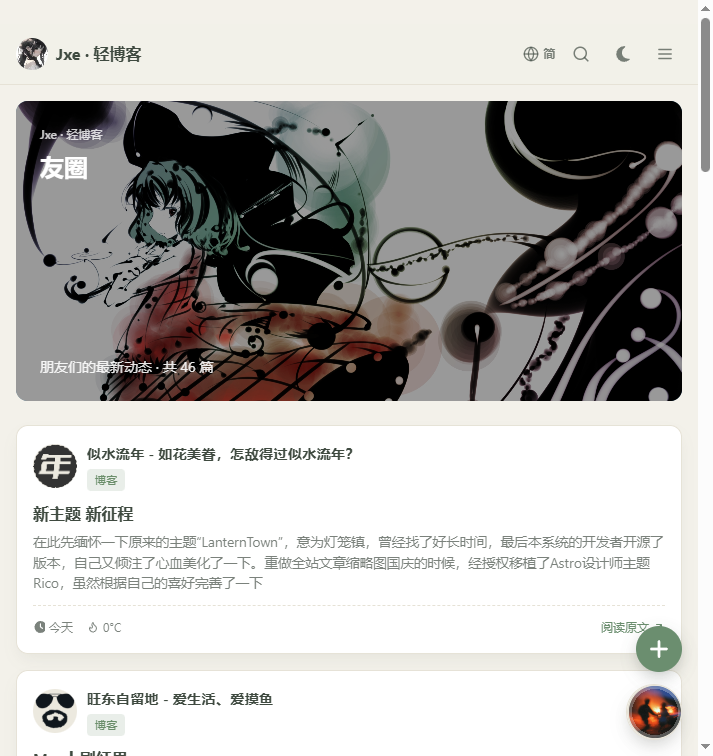
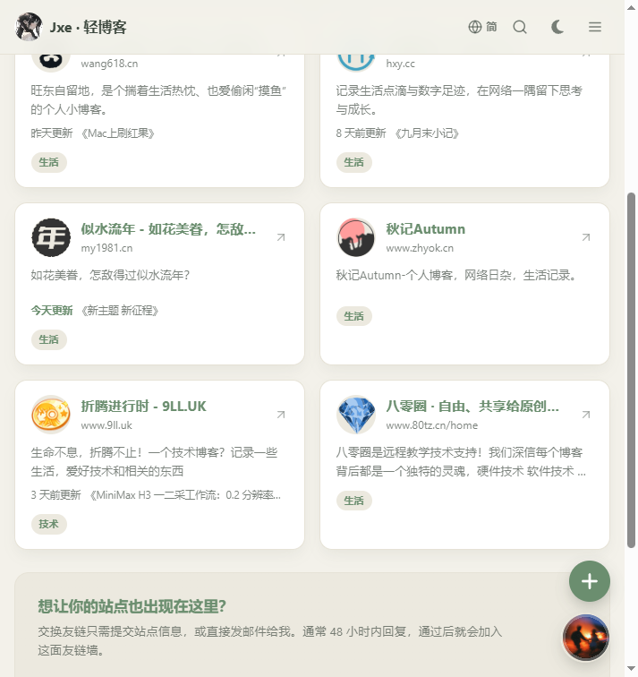

# 友圈上线了

友情链接挂了一排，但平时真很少点。不是不关心，是想不起来——谁最近更新了、写的啥，得一个站一个站点开过去才知道。

于是让服务器替我串门：每隔一段时间把友站的新文章抓回来，汇总到一个页面。就是导航栏多出来的「友圈」。

## 怎么干活的

Cloudflare Worker 每小时跑一次定时任务，挨个请求各站的 RSS/Atom，解析完丢进 D1，每个站只留最新 12 篇。访客打开页面读的是数据库，不实时请求友站，边缘还缓存两分钟，速度和普通页面没区别。现在已经攒了 46 篇。

## 中间踩的几个坑

**订阅地址不统一。** 有的站是 `/rss.xml`，有的只有 `/feed/`，还有藏在 `/index.xml` 的。光看页面里的声明经常扑空，最后列了七个常见路径挨个试，能真正解析出文章才算数。

**摘要里全是代码。** 刚上线一看，摘要里夹着 `<section><h2>` 这种标签，配图也全是 0。原因说起来很无聊：很多 RSS 把正文里的尖括号转义成 `&lt;` 存，我却先剥标签、后解码——剥的时候还没有真正的尖括号，当然啥也剥不掉。把顺序反过来，先解码再处理，图片和摘要就都正常了。

**一个站霸屏。** 刚开始按发布时间排，赶上某个站一天发好几篇，整屏全是他。现在改成按站点交错，同一个站的文章不挨着出现，刷起来均匀多了。

**图片防盗链。** 有的图床校验来路，直接裂图。先让图片不带 Referer 请求，能绕过一大半；还不行的再自动走我自己的图片代理兜底，数据库里仍然存原图地址。

**被防火墙拦的。** 有的站装了防护，服务器从机房 IP 去抓，拿到的是验证页而不是 RSS。这种只能麻烦站长放行一下 feed 路径，急不来。

**自己的锅。** 改友链显示的时候，顺手给一个时间戳变量起名叫 `t`，把翻译函数 `t()` 给顶掉了，页面直接白掉，报 `t is not a function`，这种低级错误值得记一笔。

## 顺手做的两件事

友链卡片上加了一行小字：「今天更新 《文章标题》」，标题能直接点过去。个把月没动静的站会淡一点，谁在认真写东西一目了然。

申请友链的表单也加了个「订阅地址」选填项，填了网址点自动获取能帮着探测 RSS，审核通过后自动收进友圈，不用我再手动配。

博客时代那种互相串门的感觉，好像回来一点了。
